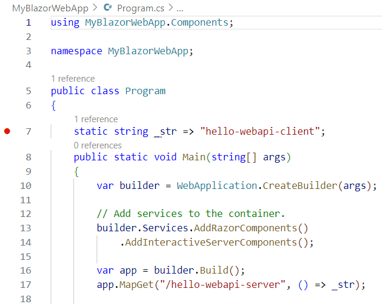
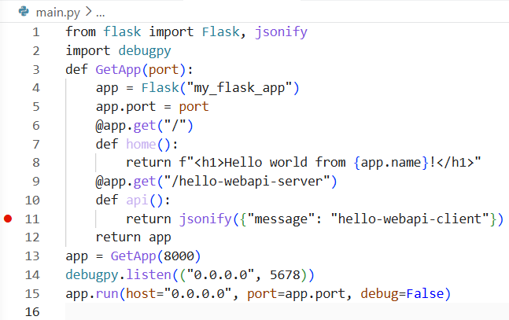

# Walkthrough called *hello-webapi*

##Background

A popular and effective starting point for learning any software development technology is a **hello-world app**, where the student is provided with a minimal build example and is able to experiment interactively; seeing immediately what changes in the pre-build development workspace cause what changes for the post-build application user. The nice learning experience, however, becomes more complicated when, instead of running locally on a single machine, the application runs across multiple machines connected over the web. The concept of a basic hello-world app assumes that the primary interface of interest is with the user, and that beneath the interface lies a single coherent system which can be built as a whole. When multiple machines are involved, however, this assumption becomes less likely to be correct; its possible that the connected machines may be developed separately and that the interface between them (API) is of at least as much interest to the student developer as the interface with the end user (GUI).    

This **hello-webapi app** puts some wider context around a basic hello-world app so the development landscape involving both client and server can be conveniently understood. Note that the walkthrough, which involves Microsoft's [VSCode](https://en.wikipedia.org/wiki/Visual_Studio_Code) and optional [Docker](https://en.wikipedia.org/wiki/Docker_(software)) containers, also involves options for a web application built either using Microsoft's [.NET](https://en.wikipedia.org/wiki/.NET) with [Blazor](https://en.wikipedia.org/wiki/Blazor) or using [Python](https://en.wikipedia.org/wiki/Python_(programming_language)) with [Flask](https://en.wikipedia.org/wiki/Flask_(web_framework)). The basic approach, however, can be used for any application development and deployment, regardless of whether the interface is web based and regardless of the underlying development platform. The walkthrough can be done locally or entirely in the cloud using Microsoft's [GitHub](https://en.wikipedia.org/wiki/GitHub) with [codespaces](https://en.wikipedia.org/wiki/GitHub_Codespaces).

##Introduction

This walkthrough provides steps for creating a VSCode environment for general development of any new application, with an emphasis on suitability for web API development.  

The development of any automated instructions must start with answers to the following 3 questions :  
Q1. What will it be developed on ?  
Q2. What will it run on ?  
Q3. What kind of interface will it present ?  
 
Web UIs and APIs are becoming increasingly dominant. In other words the answers to Q2 & Q3 are increasingly becoming "a container" and "http". Developing web servers is far from a trivial undertaking so the answer to Q1 has a huge impact not only on the developer experience, but also on user's ablity to see and understand the structure of the information they're interacting with. This walkthrough shows how the Microsoft .NET web development platform called Blazor 
can be used to provide a clean platform which answers Q1 nicely. We will walk through the following steps :  
- create a new web server application from a hello-world template  
- add a trivial api to the server by registering a getter called "hello-webapi-server"  
- link the getter to some automation which answers with "hello-webapi-client"  
- use vscode to run and debug a web server running locally   
- use vscode to attach to a web server running remotely (in a container with integral debugger) 

## Prerequisites

If performed locally then installations of [VSCode](https://code.visualstudio.com/download) and either [dotnet-SDK](https://dotnet.microsoft.com/en-us/download/dotnet) or [Python](https://www.python.org/downloads/) are needed, and preferebly [DockerDesktop](https://www.docker.com/products/docker-desktop/). If performed in the cloud then just a [GitHub](https://github.com/) account is required, configured with a repository and a [codespace](https://docs.github.com/en/codespaces/quickstart).

## Quickstart 

Minimum set of commands to make something happen using the basic hello-world app.   

Step QS1 - Open VSCode in an empty folder and create a new project.   

=== ".NET Blazor"
    ```
    # Run command in a VSCode terminal (eg. bash or powershell).
    # Adjust the framework verion to suit what is available.
    # Prerequisites :
    #    dotnet-SDK (already included in GitHub codespaces)
    #    C# VSCode extension 
    dotnet new blazor -n MyBlazorWebApp --framework net8.0 --use-program-main  
    ```
=== "Python Flask"
    ```
    # Create a new file called ~/src/main.py and paste this code into it.
    # Prerequisites :
    #    pip install flask 
    #    pip install debugpy
    from flask import Flask, jsonify
    import debugpy
    def GetApp(port):
        app = Flask("my_flask_app")
        app.port = port
        @app.get("/")
        def home():
            return f"<h1>Hello world from {app.name}!</h1>"
        @app.get("/hello-webapi-server")
        def api():
            return jsonify({"message": "hello-webapi-client"})
        return app
    app = GetApp(8000)
    debugpy.listen(("0.0.0.0", 5678))
    app.run(host="0.0.0.0", port=app.port, debug=False)
    ```

Step QS2 (option a) - Run command in VSCode terminal then click on hyperlink in command window. 

=== ".NET Blazor"
    ```
    dotnet run --project MyBlazorWebApp  
    ```
=== "Python Flask"
    ```
    python src/main.py 
    ```

Step QS2 (option b) - Run in a Docker container (must copy dockerfile from setb 5b first !)  

    docker rm -f csharpcontainer1 
    docker build . -t csharpimage1:debug  
    docker run -d -p 5000:8080 -p 5001:8081 --name csharpcontainer1 csharpimage1:debug  
    start msedge "http://localhost:5000"    

The rest of the walkthrough goes through the same things but in more detail, and with a trivial API and debugging.


## Step 1of7 : Install the VSCode extension called "C#"

This is required for steps 2, 4 & 7.

## Step 2of7 : Create a hello-world web app using Blazor.

Starting from your choice of local empty folder in a VSCode terminal, create a new app.  

=== ".NET Blazor"
    ```
    # Run command in a VSCode terminal (eg. bash or powershell).
    # Adjust the framework verion to suit what is available.
    # Prerequisites :
    #    dotnet-SDK (already included in GitHub codespaces)
    #    C# VSCode extension 
    dotnet new blazor -n MyBlazorWebApp --framework net10.0 --use-program-main  
    ```
=== "Python Flask"
    ```
    # Create a new file called ~/src/main.py and paste this code into it.
    # Prerequisites :
    #    pip install flask 
    #    pip install debugpy
    from flask import Flask, jsonify
    import debugpy
    def GetApp(port):
        app = Flask("my_flask_app")
        app.port = port
        @app.get("/")
        def home():
            return f"<h1>Hello world from {app.name}!</h1>"
        @app.get("/hello-webapi-server")
        def api():
            return jsonify({"message": "hello-webapi-client"})
        return app
    app = GetApp(8000)
    debugpy.listen(("0.0.0.0", 5678))
    app.run(host="0.0.0.0", port=app.port, debug=False)
    ```

Note : The ports that the app uses seem to vary depending on the build circumstances. Its not essential to know about this during the walkthrough, but noting here because its not obvious and can be confusing. When built in vscode the http(s) ports seem to be determined by the file *~\Properties\launchSettings.json*. When built inside a container the http(s) ports seem to be 8080 and 8081. It may be possible to influence which ports the container chooses by inserting EXPOSE instructions into the dockerfile.

    EXPOSE 5002
    EXPOSE 5003

or if not then maybe by adding the following to the *~\appsettings.json* file.

    "Kestrel": {
       "Endpoints": {
         "Http": {
           "Url": "http://0.0.0.0:5100"
         }
       }
     },

## Step 3of7 : Add a debug breakpoint inside custom http getter.

=== ".NET Blazor"
    Add a line to *~\Program.cs* declaring the property *_str* in between the *Program* class definition and the *Main* method.
    ```
    public class Program
    {
       static string _str => "hello-webapi-client";     <------------ copy this line
       public static void Main(string[] args)
    ```
    Add a line to *~\Program.cs* calling MapGet after the Build call.
    ```
    var app = builder.Build();
    app.MapGet("/hello-webapi-server", () => _str);      <------------ copy this line
    ```    
    Set a debugger breakpoint on the *hello-webapi-client* line. 
    <figure markdown="span">
    
    <figcaption>breakpoint inside custom http getter (C#)</figcaption>
    </figure>
=== "Python Flask"
    Set a debugger breakpoint on the *hello-webapi-client* line. 
    <figure markdown="span">
    
    <figcaption>breakpoint inside custom http getter (Python)</figcaption>
    </figure>

## Step 4of7 : (optional) debug the project in VSCode

Build and run the project in vscode.

=== ".NET Blazor"
    ```
    dotnet run --project MyBlazorWebApp  
    ```
=== "Python Flask"
    ```
    python src/main.py 
    ```
Make sure the following item appears in the "configurations" field in the *~\.vscode\launch.json*. If you don't yet have a *~\.vscode\launch.json* file then the VSCode "Run and Debug" page will have a hyperlink called "create a launch.json" file.  

=== ".NET Blazor"
    This allows the VSCode debugger to be attached to a .NET Core project running on the same machine. Select ".NET Core Attach" from the VSCode "Run and Debug" dropdown, then press the adjacent green triangle to start debugging and choose "MyBlazorWebApp.exe" when prompted to choose from the list of available processes.
    ```
    {
        "name": ".NET Core Attach",
        "type": "coreclr",
        "request": "attach",
    },    
    ```
=== "Python Flask"
    This allows the VSCode debugger to run and attach to the currently selected python file. Select "Python Debugger: Current File" from the VSCode "Run and Debug" dropdown, then press the adjacent green triangle to start debugging.
    ```
    {
        "name": "Python Debugger: Current File",
        "type": "debugpy",
        "request": "launch",
        "program": "${file}",
        "console": "integratedTerminal"
    },
    ```

Pointing a web browser at *http://localhost:5000* (with the port edited appropriately) should show a "hello world" web page. If running in VSCode then the command line will tell you which port is actually listening. If running in a GitHub codespace in the cloud then the machine name won't be localhost, but the ports tab will provide a hyperlink. Pointing a web browser at *http://localhost:5000/hello-webapi-server* should cause the breakpoint from step 3 to be hit.  

## step 5a-of-7 : Create dockerfile - option 1of2 - auto

Option 1 involves auto-creating the dockerfile and then doing minor manual tweaks. Install the VSCode extension "Container Tools" and run the command pallette item "containers: add docker files to workspace...", choosing the following settings :

=== ".NET Blazor"
    ```
                   application platform = .NET:ASP.NET Core
                       operating system = Linux
                                  ports = <blank>
    include option Docker compose files = No
    ```
    Note : The VSCode extension seems to put the dockerfile it creates alongside ~\Program.cs*. It is suggested to move it up into the root folder instead.  

    Manual tweak 1 - insert after first line (subject to comments in step 5b about possible restrictions on a corporate PC)
    ```
    RUN apt-get update && apt-get install -y unzip curl \
        && curl -sSL https://aka.ms/getvsdbgsh -o getvsdbg.sh \
        && chmod +x getvsdbg.sh \
        && ./getvsdbg.sh -v latest -l /vsdbg
    ```
    Manual tweak 2 - change 2 instances of the variable "configurations" from Release to Debug.
    
=== "Python Flask"
    ```
                   application platform = Python Flask
                        app entry point = main.py
                                   port = 8000
    include option Docker compose files = No
    ```
    Note : The dockerfile created by the VSCode extension doesn't seem to work in this example. Information which will probably help understand why is available in [VSCode-quickstart-python](https://code.visualstudio.com/docs/containers/quickstart-python). For now just use step 5b instead !
       
## Step 5b-of-7 : create dockerfile - option 2of2 - manual

Option 2 involves creating the dockerfile manually. Create a new text file in the root folder, call it "dockerfile", and copy all text below into it. 

=== ".NET Blazor"
    Note : the aspnet & sdk image versions must match the framework version used in step 2.
    ```
    # # Option A - Runs in a GitHub codespace but may not run on a corporate PC.
    # # The "RUN apt-get" section may be prevented by restrictions on a corporate PC 
    # #     resulting in the error message : "ERROR: No internet connection.", but the error 
    # #     appears to have something to do with signatures rather than actually a lack of connection.
    # # Use the "aspnet" runtime container image (which excludes the SDK).
    # FROM mcr.microsoft.com/dotnet/aspnet:10.0 AS base
    # # Install the .NET Core debugger to allow remote debugging of the containerized app from Visual Studio or VSCode
    # RUN apt-get update && apt-get install -y unzip curl \
    #     && curl -sSL https://aka.ms/getvsdbgsh -o getvsdbg.sh \
    #     && chmod +x getvsdbg.sh \
    #     && ./getvsdbg.sh -v latest -l /vsdbg
    # WORKDIR /app
    # USER app
    # # Use the "sdk" container image to allow use of dotnet restore / dotnet build / dotnet publish.
    # FROM --platform=$BUILDPLATFORM mcr.microsoft.com/dotnet/sdk:10.0 AS build
    
    # Option B - use base image prepared by gcsestudent2
    # See notes for details of how to create a base image.
    # Note that version 8.0 is used instead of version 10.0!
    FROM ghcr.io/gcsestudent2/aspnet:8.0 AS base
    WORKDIR /app
    USER app
    FROM mcr.microsoft.com/dotnet/sdk:8.0 AS build
    
    #ARG configuration=Release
    ARG configuration=Debug
    WORKDIR /src
    COPY ["MyBlazorWebApp/MyBlazorWebApp.csproj", "MyBlazorWebApp/"]
    RUN dotnet restore "MyBlazorWebApp/MyBlazorWebApp.csproj"
    COPY . .
    WORKDIR "/src/MyBlazorWebApp"
    RUN dotnet build "MyBlazorWebApp.csproj" -c $configuration -o /app/build
    
    FROM build AS publish
    #ARG configuration=Release
    ARG configuration=Debug
    RUN dotnet publish "MyBlazorWebApp.csproj" -c $configuration -o /app/publish /p:UseAppHost=false
    
    FROM base AS final
    WORKDIR /app
    COPY --from=publish /app/publish .
    ENTRYPOINT ["dotnet", "MyBlazorWebApp.dll"]
    ```
=== "Python Flask"
    ```
    FROM python:3.12-slim-bookworm
    WORKDIR /usr/src/app
    COPY ./src /usr/src/app
    RUN pip install flask
    RUN pip install debugpy
    EXPOSE 8000
    CMD ["python", "./main.py"] 
    ```

## Step 6of7 : Build a new Docker container and run it.

Check that docker is running. If using a GitHub codespace it can be assumed docker will already be running, but if using DockerDesktop on a corporate PC then it will likely require an attachment to the corporate VPN. Once docker is running then use the following commands to build a new container image :

    # Stop and remove container if it already exists from previous attempts.
    docker rm -f csharpcontainer1

    # Build new container image.
    docker build . -t csharpimage1:debug

Then use the following command to create a new container from the image and run it :

=== ".NET Blazor"
    ```
    docker run -d -v ./MyBlazorWebApp:/src/MyBlazorWebApp -p 5000:8080 -p 5001:8081 --name csharpcontainer1 csharpimage1:debug
    ```
=== "Python Flask"
    ```
    docker run -d -v ./src:/usr/src/app -p 5678:5678 -p 5000:8000 --name csharpcontainer1 csharpimage1:debug
    ```

Pointing a web browser at http://localhost:5000 should show a "hello world" web page if running on a local PC. If running in a GitHub codespace then the machine name won't be localhost, but the ports tab will provide a hyperlink.  

    start msedge "http://localhost:5000"


Useful docker admin tips :  

Open a bash shell within the container to allow its contents to be inspected. Note : use "exit" to escape from shell!

    docker exec -it csharpcontainer1 /bin/bash
    
List containers to check csharpcontainer1 is still running     

    docker ps -a    

## Step 7of7 : (optional) Attach to the running container using VSCode

Make sure the following item appears in the "configurations" field in the *~\.vscode\launch.json*. If you don't yet have a *~\.vscode\launch.json* file then the VSCode "Run and Debug" page will have a hyperlink called "create a launch.json" file.  This allows the VSCode debugger to be attached to a .NET Core project running inside a Docker container. Select "Remote Attach" from the VSCode "Run and Debug" dropdown, then press the adjacent green triangle to start debugging.

=== ".NET Blazor"
    Choose  "MyBlazorWebApp.dll" when prompted to choose from the list of available processes.
    ```
    {
        "name": "Remote Attach(.NET)",
        "type": "coreclr",
        "request": "attach",
        "processId": "${command:pickRemoteProcess}",
        "pipeTransport": {
           "pipeProgram": "docker",
           "pipeArgs": [ "exec", "-i", "csharpcontainer1" ],
           "debuggerPath": "/vsdbg/vsdbg",
           "pipeCwd": "${workspaceFolder}",
           "quoteArgs": false
        },
        "sourceFileMap": { 
         "/src/MyBlazorWebApp/": "${workspaceFolder}/MyBlazorWebApp"
        }
    },
    ```
=== "Python Flask"
    ```
    {
       "name":"Remote Attach(Python)",
       "type":"debugpy",
       "request":"attach",
       "connect":{
          "host":"localhost",
          "port":5678
       },
       "pathMappings":[
          {
             "localRoot":"${workspaceFolder}/src",
             "remoteRoot":"."
          }
       ],
       "justMyCode":true
    },       
    ```
Appending the text "/hello-webapi-server" to URL in the web browser from step 6 should cause the breakpoint from step 3 to be hit.
        
## Note 1 : How to push a Docker image to the GitHub Container Registry

Using a self-hosted container registry is a more secure alternative than pushing to GitHub container registry. This walkthrough uses the GitHub container registry provided by gcsestudent2 in workaround option B, when option A fails. This note shows how a provider like gcsestudent2 can push to the GitHub container registry.  

Use github to create a new personal access token (PAT)  
-  Go to: https://github.com/settings/tokens  
-  Click Generate new token → Generate new token (classic)  
-  Give it a name like: GHCR push  
-  Tick these scopes:  
-  o  write:packages  
-  o  read:packages  
-  o  delete:packages (optional)  
-  o  repo (recommended if your package is private)  
-  Scroll down → click Generate token  
-  GitHub will show you a long-random-string  

Use dockerfile to build the image "aspnet:8.0"

    docker build . -t aspnet:8.0

Tag the image ready for pushing to the GitHub Container Registry under the accout "gcsestudent2"  

    export CR_PAT=<long-random-string from above>
    echo $CR_PAT | docker login ghcr.io -u gcsestudent2 --password-stdin
    docker tag aspnet:8.0 ghcr.io/gcsestudent2/aspnet:8.0
    docker push ghcr.io/gcsestudent2/aspnet:8.0

## Note 2 : More sophisticated webapi argument handling

=== ".NET Blazor"
    ```
    async static Task _GetStr(HttpContext httpContext) {
        var request = httpContext.Request;
        var arg1 = (string?)request.RouteValues["arg1"];
        var queryKeys = request.Query.Keys.ToArray();
        foreach (var item in queryKeys){
            var bGot = request.Query.TryGetValue(item, out var queryVal);
        }
        var responseText = "hello-webapi-client\narg1 = " + arg1;
        var bytes = System.Text.Encoding.UTF8.GetBytes(responseText);
        await httpContext.Response.Body.WriteAsync(bytes);
    }    
    
    app.MapGet("/hello-webapi-server", () => _str);
    app.MapGet("/hello-webapi-server/{arg1}", _GetStr);
    ```
=== "Python Flask"
    ```
    @app.get("/hello-webapi-server/<arg1>")
    def api2(arg1):
        q = request.args.get("q")  
        r = request.args.get("r")  
        if arg1 == "a1" :
            return jsonify({"message": f"hello-webapi-client ({arg1})", \
                            "arr"    : [1,2,3,4.1],
                            "q"      : f"{q}",
                            "r"      : f"{r}"})
        else :
            return jsonify({"message": f"unknown command"})
    ```
    