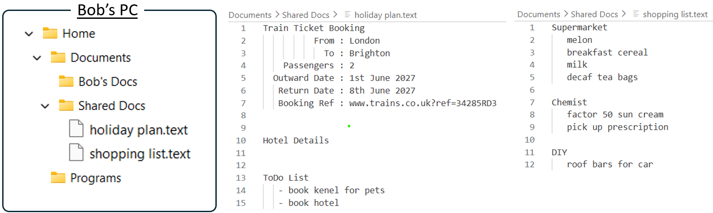
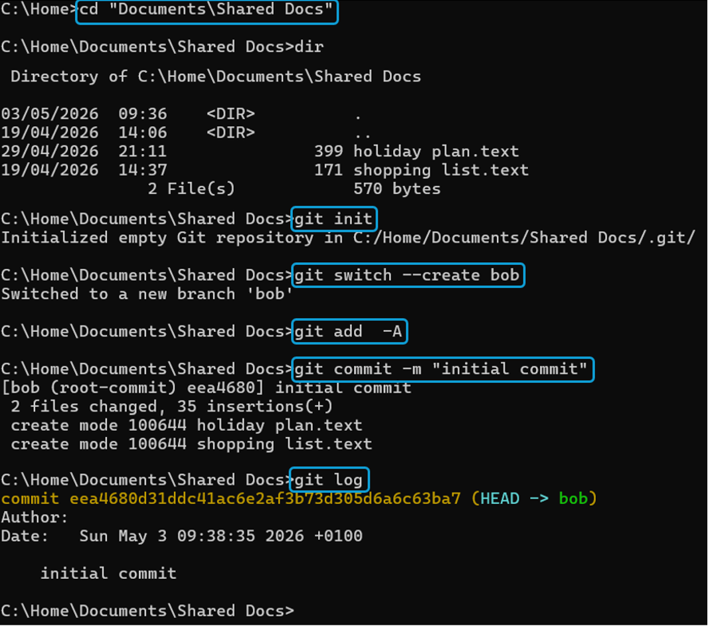
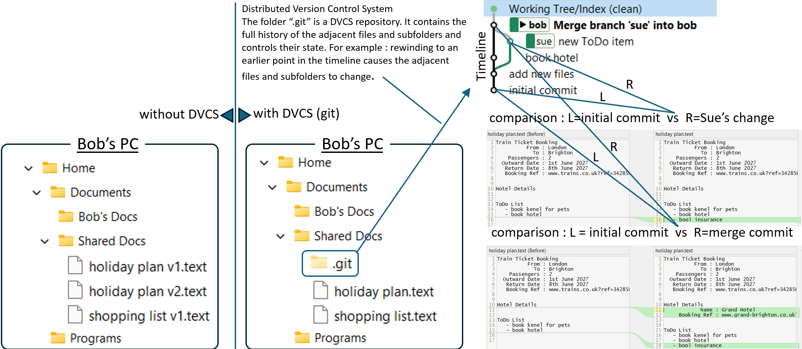
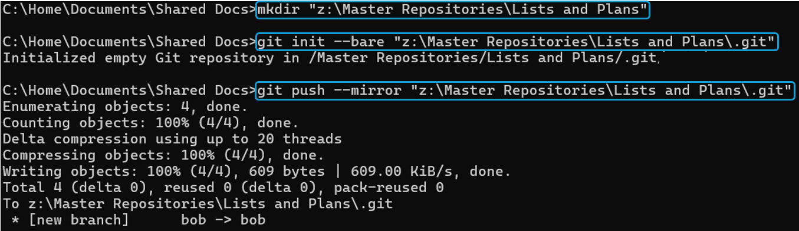
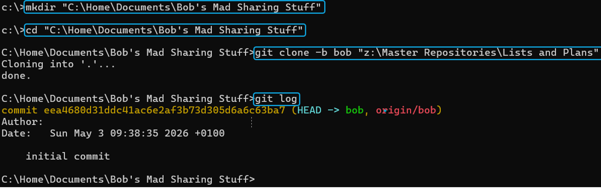
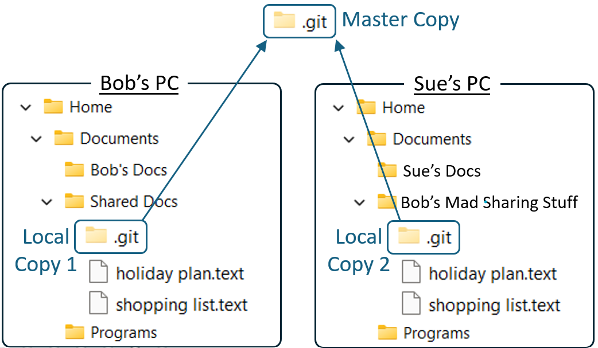

# DVCS - What is it?

##Introduction

On the previous page we saw why Distributed Version Control Systems might be more relevant to non-software specialists than most people assume. Users of DVCS tend to find the concepts intuitive in retrospect. They often forget, however, that there is a penny-dropping moment prior to which everything sounds baffling, and this causes many would-be students to prematurely drop their inquisitive forrays into the subject. This page walks through a sequence of easy-to-understand imaginary scenarios which are intended to help the reader through to the penny drop.

##Scenario 1 - A few local text files.

Bob is using his PC to keep a simple text note of some information about a holiday he’s planning with his wife Sue, and also a list of some shopping items needed for their house. He knows there are some neat web apps which could help him keep track of this kind of information, but he prefers to keep it in a simple location he controls and understands, at least to start with. He sends copies of the text information to Sue by email so she knows what he’s planning.



##Scenario 2 - Using DVCS to keep track of changes locally.

Soon they both start thinking of new things to add, and since Sue doesn’t hold the latest list she feeds her changes in via email, obliging Bob to keep track of multiple different iterations. One way for him to avoid confusion could be to keep different concurrent versions of the file with suffixes like v1, v2, etc. That’s awkward, however, and he may become tempted to give up on the local option and just move the files somewhere into the cloud where they can both work on one shared copy, eliminating the need for versions. This would sacrifice the control and simple understanding he liked about the local option. DVCS offers an alternative to the sacrifice which is not only simpler but also more powerful, capturing the different versions and presenting changes as points in a timeline (also known as commits in a repository). The repository exists in a local folder called “.git” which, even if it just stays local, is game-changingly useful with all history being easily compared or retrieved. Open the "Step-by-step commands" call-out below to see details of how Bob can easily create a new repo. 

??? Note "Step-by-step commands"

      The commands below can be run in a command window. They require git to have been [install](https://git-scm.com/install/)ed.
      Note that the basic git intstallation is a command line utility (i.e. the user interacts using text commands). It is possible to use git purely via the command line, and many advanced users choose to do this, but new or occasional users often find it easier to interact with git via one of several graphical user interfaces such as [SmartGit](https://www.smartgit.dev/) or [Sourcetree](https://www.sourcetreeapp.com/).
      
      ```
      cd "Documents\Shared Docs"        change to the folder where holiday plan.text and shopping list.text exist
      git init                          creates a new repo in the folder called ".git"
      git switch --create bob           creates a new branch in the repo called "bob" and starts using it
      git add  -A                       prepares to commit all files (in this case 2 text files) aka. "staging"
      git commit -m "initial commit"    goes ahead with the commit and marks it with the message "initial commit"
      git log                           view a history of recent commits
      ```

      



In the next scenario we'll see how when multiple people use a repository to collaborate, the usefulness is amplified even further.

##Scenario 3 - Using DVCS to collaborate.

The arrangement continues for a while with Bob maintaining his local git repo, and Sue occasionally receiving or contributing changes via email. Eventually, however, it starts to feel asymmetrical with Sue at an information disadvantage and Bob burdened with all the coordination. Happily with the DVCS model its easy to make it symmetrical with all participants having their own local repo copies, interconnected via a central master repo copy. All .git repos are copies of the same thing and behave in exactly the same way as each other. If Bob and Sue’s PCs are on the same LAN then the master copy could be another folder in a shared area just like the two local copies, otherwise its possible to have the master copy as a web server in the cloud. Open the "Step-by-step commands" call-out below to see details of how Bob can create a shared master, and how Sue can start participating on an equal footing as Bob. 

??? Note "Step-by-step commands"
      Let's assume that the Z: drive represents some LAN storage which is available to both Bob and Sue.
      
      Bob can use these commands to mirror his local repo to a master location which is accessible to Sue. 
      ```
      mkdir "z:\Master Repositories\Lists and Plans"                  prepare a new empty remote folder
      git init --bare "z:\Master Repositories\Lists and Plans\.git"   create a bare git repo in it acting as the master
      git push --mirror "z:\Master Repositories\Lists and Plans\.git" mirror the local repo into the master repo
      ```                                                             
                                  
                                                                      
      Sue can then clone her own local repo from the master.          
      ```                                                             
      mkdir "C:\Home\Documents\Bob's Mad Sharing Stuff"               prepare a new empty local folder 
      cd "C:\Home\Documents\Bob's Mad Sharing Stuff"                  change into it
      git clone -b bob "z:\Master Repositories\Lists and Plans" .     clone from Bob's remote master and use the branch "bob" 
      git log                                                         view a history of recent commits
      
      ```
      



Shared repos just like this have become a ubiquitous standard, not only acting as the backbone of open source software development platforms, but also providing an equally important way for teams to track and coordinate their private electronic material.

##Conclusion.

Users are increasingly expected to interact with information residing in systems which appear remote and inaccessible, whose workings appear obscure and put the information beyond their full control. DVCS, by simply providing a standard way for teams to control local files, plays a foundational role in the development of these seemingly remote and complex systems. Rather than seeing DVCS as an obscure instrument of complexity, this introduction encourages readers to feel empowered by seeing its true nature as just simple standard interface, not only giving them greater control of their own information, but perhaps also illuminating some of the darkness by opening the door to a world of open source knowledge, tools and participation.
