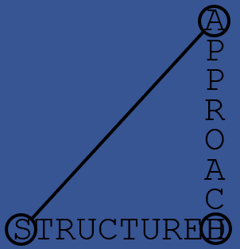

{ width="120" style="float: left; margin: 0 15px 15px 0;" }

I am a data-smith [^1] and coder seeking community dialogue about the direction of software.

Jensen Huang predicted in 2017 that "AI is going to eat software" in a neat reference to Marc Andreessen's
prediction in 2011 that [software is eating the world](https://a16z.com/why-software-is-eating-the-world/).
Perhaps these soundbites are intended to inspire healthy thoughts of natural selection, 
but they go a step further with a questionable ring of canibalism to them. 
More recently similar concerns have been excacerbated by the questionabe predictions of a pathway from 
[LLM](https://en.wikipedia.org/wiki/Large_language_model)s to [AGI](https://en.wikipedia.org/wiki/Artificial_general_intelligence),
and irresponsible attitudes towards the possibility of a [technological singularity](https://en.wikipedia.org/wiki/Technological_singularity).

One unquestionable change has been the growing reliance on web connections across large areas of human
endeavour including software. Sir Tim Berners-Lee's excellent book [This Is For Everyone](https://www.panmacmillan.com/authors/tim-berners-lee/this-is-for-everyone/9781035023677) explains how it is important for everyone that the web serves everyone. I like his idea of transforming the web 
from an attention economy to an intention economy, and furthermore I think the need to transform 
our tools applies at a level down from the web also : i.e. software tools.

Software is an important medium through which humans are given agengy. If AI were to swallow software humans would lose out. 
Instead I propose the term "natural computing" as both the literal opposite and the logical accompaniment 
to "artificial intelligence" : the ability to instruct computers could be made much more accessible 
to all, to the point where it becomes a basic literacy.

[^1]: The term data-smith is introduced here to describe people who work with data, in a loosely 
similar way to a blacksmith works with iron, or a locksmith works with locks.
